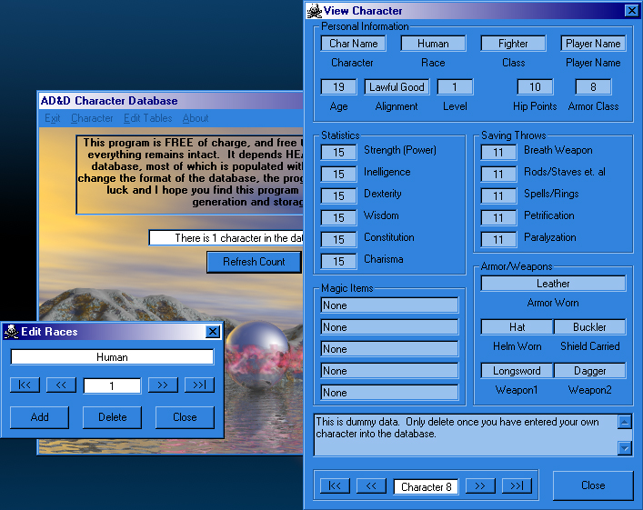



## AD&D Character Generator

### Description

((UPDATED!!!)) I commented the code and added a "Generate Character Stats" button on the Add Character form... I still need to add some rules for the generation. This is a new program I am just beginning to work on. I would like ideas on what to add. It is far from finished, but like I said, I would like some ideas. It uses an Access2000 database (included) and I have included an executable.
 
### More Info
 

             |
---                |---
**Submitted On**   |2000-08-01 15:11:26
**By**             |[VBScript](https://github.com/Planet-Source-Code/PSCIndex/blob/master/ByAuthor/vbscript.md)
**Level**          |Intermediate
**User Rating**    |4.7 (14 globes from 3 users)
**Compatibility**  |VB 6\.0
**Category**       |[Databases/ Data Access/ DAO/ ADO](https://github.com/Planet-Source-Code/PSCIndex/blob/master/ByCategory/databases-data-access-dao-ado__1-6.md)
**World**          |[Visual Basic](https://github.com/Planet-Source-Code/PSCIndex/blob/master/ByWorld/visual-basic.md)
**Archive File**   |[CODE\_UPLOAD8484812000\.zip](https://github.com/Planet-Source-Code/vbscript-ad-d-character-generator__1-10245/archive/master.zip)

